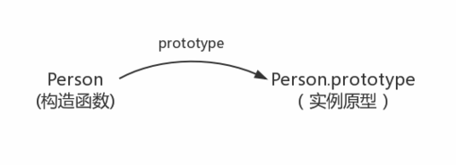
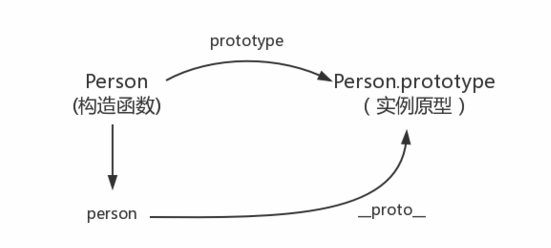
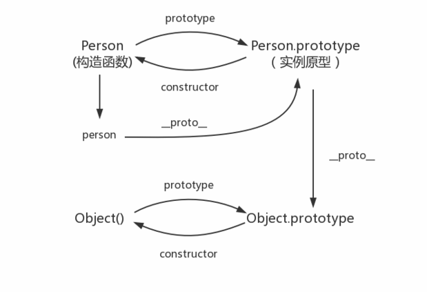
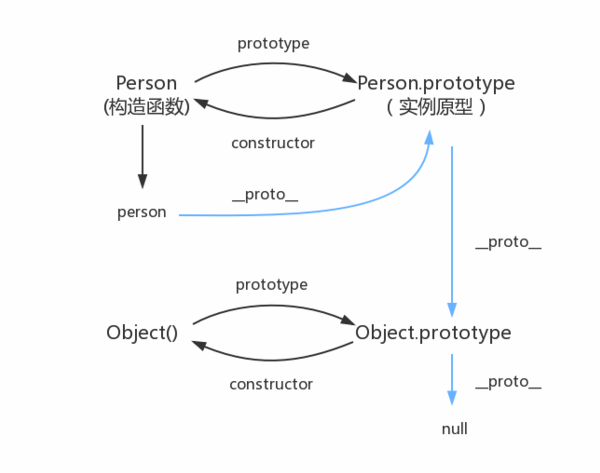

## 构造函数创建对象

```
function Person() {
  
}
var person = new Person();
person.name ='name';
console.log(person.name); // name
```

在这里，Person就是一个构造函数，用new创建了一个实例对象person

## prototype

每个函数都有一个prototype属性，就是我们经常看到的那个prototype

```
function Person() {}
// prototype 是函数才会有的属性
Person.prototype.name = 'name';
var person1 = new Person();
var person2 = new Person();
console.log(person1.name);//name
console.log(person2.name);//name
```

那么这个函数的prototype属性到底指的是什么？这个函数的原型是什么？

其实，函数的prototype属性指向了一个对，这个对象正是调用该构造函数而创建的实例，也就是这个例子中person1和person2的原型。

> 每一个JavaScript对象（null除外）在创建的时候会与之关联另一个对象，这个对象就是我们所说的原型，每一个对象都会从原型“继承”属性。

构造函数和实例原型之间的关系：



在这里用Object.prototype表示实例原型

## __proto__

这是每一个JavaScript对象都具有的一个属性，叫__proto__ ,这个属性会指向该对象的原型。

```
function Person() {}
var person = new Person();
console.log(person.__proto__ === Person.prototype);// true
```

更新关系图：




实例对象和构造函数都可以指向原型，原型中是否也有属性指向构造函数或实例？

## constructor

原型没有指向实例的属性，因为一个构造函数可以生成多个实例，但是原型指向构造函数是有的。在每一个原型中都有一个constructor属性指向关联的构造函数

```
function Person(){}
console.log(Person === Person.prototype.constructor);// true
```

综上得出：

```
function Person(){}
var person = new Person();
console.log(person.__proto__ == Person.prototype);//true
console.log(Person.prototype.constructor=== Person);//
// 一个ES5的方法，可以获得对象的原型
console.log(Object.getPrototypeOf(person) === Person.prototype) // true
```

## 实例与原型

当读取实例的属性时，如果找不到就会查找与对象相关联的原型中的属性，如果还查找不到就会去找原型的原型，一直找到顶层为止。

```
function Person() {}
Person.prototype.name = 'name';
var person = new Person();
person.name = 'new name';
console.log(person.name);//new name
deleate person.name;
console.log(person.name);// name
```

在这里我们设置了person的name属性，所以我们可以读取到‘new name’，当我们删除了person的name属性时，读取person的name属性，从person找不到就会从person的原型也就是person.__proto__ == Person.prototype中查找，幸运的是我们找到了‘name’，但是万一没找到？原型的原型优势什么？

原型也是一个对象，既然是对象，就可以用最原始的方式创建它，那就是

```
var obj = new Object();
obj.name = 'naem';
console.log(obj,name);//name
```

所以原型对象是通过Object构造函数生成的，结合之前，可以更新关系图像：



## 原型链

那么Object.prototype 的原型呢？

null，所以查找到Object.prototype就可以停止查找了

总结最后的关系图：



图中由相互关联的原型组成的链状结构就是原型链，也就是蓝色的这条线。

## 补充

```
function Person() {}
var person = new Person();
console.log(person.constructor === Person);// true
```

当获取person.constructor时，其实person中并没有constructor属性，当不能读取到constructor属性时就会从person的原型也就是Person.prototype中读取，正好原型中有该属性，所以

`person.constructor === Person.prototype.constructor`

其次就是__prototype__,绝大部分浏览器都支持这个非标准的方法访问原型，然而他并不存在与Person.prototype中，实际上，它来自于Object.prototype，与其说是一个属性，不如说是一个getter/setter，当使用obj.__proto__时，可以理解成返回了Object.getPrototypeOf(obj)

最后关于继承，前面说的每一个对象都会从原型“继承”属性，实际上，继承时一个十分具有迷惑的说法，继承意味着复制操作，然而JavaScript默认并不会复制对象的属性，相反，JavaScript只在两个对象之间创建一个关联，这样，一个对象就可以访问另一个对象的属性和函数，所以与其叫继承，委托的说法反而更准确些。

