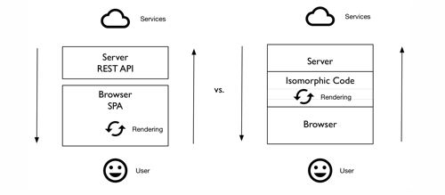

在web开发领域， 同构 的意思是同时在服务器和客户端渲染页面。同构JS通常是通过Node.js/Io.js实现的，因为它们支持可以复用的第三方库，同时支持代码在只有少量修改的情况下同时运行在浏览器和Node.js/Io.js环境上。由于有着这样的互换性，Node.js和JavaScript生态有着一堆支持同构的框架，例如 React.js 。 
 ;
### 三个开发者吹捧同构的原因：
- 更好的搜索引擎优化(SEO)
- 更好的性能
- 更好的维护性
在我们讨论这些好处之前，我们先回顾一下web的历史，看看为什么会和同构扯上关系。
### Web开发快速回顾
很久很久以前(其实并不久)，HTML页面是全部由服务器端渲染的，那时网页的用户体验要比原生的桌面应用差很多。用户的每一次操作都会导致页面的刷新，例如提交表单，雪上加霜的是那时的带宽也。。。
2000年开始，所谓的单页应用(SPA)变得流行起来，因为其架构允许更加优雅而且用户体验如同桌面应用一般的应用(如今，桌面应用很多是用web技术通过Electron 或者 Adobe Air包装后生成，真是风水轮流转)。单页应用主要的特质是他们不需要页面刷新，它通过异步获取数据而不阻塞用户其他的操作。举个栗子，你可以同时在gmail里标注多封邮件，而不需要做完一个等服务器返回正确后再做下一个，这样的体验造就了SPA如同桌面应用一般的用户体验，这就是为什么这些年我们用了很多SPA，google doc是个好例子，或许还有更多。
另外SPA是在浏览器端渲染和修改HTML页面的，这样的方式减少了负载，因为这些服务器端只需要返回JSON而不是整个HTML文件。然后万物都有两面性：
- 大部分搜索引擎在爬页面时不支持客户端的渲染。甚至Google都说过页面代码要足够简单，才能让爬虫正确的抓取。
- 当SPA应用变得越来越庞大时，就会有越来越多的前端JS文件需要用户去下载，从而导致了很多应用在使用之前都要'Loading'半天。
- 当然用户不能把浏览器的JavaScript屏蔽了。
- 在页面骨架加载完成之后，用户还需要等待AJAX请求返回，才能真正开始使用。
而在非同构的架构上谈论这些问题是相当累赘的。服务器端渲染页面在同构流行之前就一直在被使用。然而服务器端像SPA般渲染页面往往需要不同的模板和逻辑，因为服务器端使用的语言各式各样，有Ruby，Java，PHP。
然而有了Node.js，服务器客户端使用同样的代码就有了可能。更不用说两端使用同样的代码，维护性比其他的策略好多了。所以现在让我们看看同构是否能解决SEO，性能，可维护性的问题。
让搜索引擎更好检索页面的能力
用Backbone.js, Angular.js, Ember.js等框架实现的单页应用很多是写作受保护的应用，这些应用需要用户名和密码才能登录。这样的SPA往往不需要SEO。
然而很多的单页应用是不需要登录保护的。这些公开的应用和页面，SEO对它们来说是很重要的，因为它们的业务模型很依赖搜索引擎带来的流量。最近，google给他们的爬虫增加了JavaScript渲染的能力。理论上来说，Google会和浏览器一样渲染一个SPA，然后检索它的页面。然而，Google自己说，这玩意不一样好使，有时会对你的站点搜索有负面的影响。所以处于保险考虑，SPA的开发者需要让他们的页面在JS禁用是渲染的和JS启用一样，以防被爬虫忽略。
有些站点比较在意搜索引擎索引，同时有些站点在乎的是高性能。像mobile.walmart.com和twitter.com在首页首次加载性能方面做很很多研究。结果确认了最佳实践是由服务器端提供尽量快速的首页首次加载，其他的代码在用户继续浏览站点时加载。这样，用户就不用看类似'loading'这样的提示，而是看到功能页，这样就提高了用户体验。
更好的代码可维护性
代码是一种负债，代码越多，你和你的团队要支持的就越多。正因如此，你正常希望避免同一个页面出现不同的模板和业务逻辑代码。幸运的是，Node.js/Io.js,还包括一些模板引擎，例如Handlebars, Mustache,和Dust，能够让在客户端的代码模块被使用在服务器端。
除了可以复用模板之外，开发者也可以在客户端和服务器使用相同的库和工具，从而避免了多余的代码。像Underscore.js, lodash, Request, 和 SuperAgent也因此非常火爆。我们也可以做一些自己的库，可以同时在浏览器和服务器运行。
同构还有一点好处要提，就是服务器端和客户端可以共享同一份数据模型，这样保证了两端的统一性。
React.js
所以现在你想在自己的web开发中引入同构了么?有很多的库和框架可以选择，这里我们选一个最火的---React.js.
React.js不是一个MVC的框架，它只是其中的视图view层。这代表着它可以和大部分其他框架一起使用。下面是React.js的一段前端代码：
``` 
var Header = React.createClass({  
    render: function(){
        return (<h1>Message Board</h1>)
    }
})
//...
```
让我们在看一段同样的Header，是在Express.js构建服务器端页面上。public/js/app.js本是浏览器端的代码，我们在服务器端复用：
```
var React = require('react/addons'),  
    components = require('./public/js/app.js'),
    Header = React.createFactory(components.Header)
    //...
    app.get('/', function(req, res, next) {
        req.messages.find({}, {sort: {_id: -1}}).toArray(function(err, docs){
            if (err) return next(err)
            res.render('index', {
                header: React.renderToString(Header()),  props: '<script type="text/javascript">var messages='+JSON.stringify(docs)+'</script>'
            })   
        })
    }
 ```   
通过props传递的数据可以在浏览器端取得。服务器端的模板引擎代码（Handlebars）如下：
```
{{{props}}}
<div id="header">  
    {{{header}}}
</div>  
```
第一次的页面加载将会很快，因为渲染发生在服务器端，只有部分DOM的更新在浏览器完成。
由于SPA如此盛行，对于两端代码统一，支持SEO，无JS客户端，更好的用户体验以及更快的首页加载的需求就更旺盛了。简而言之，同构JavaScript就是这个web开发问题的答案。