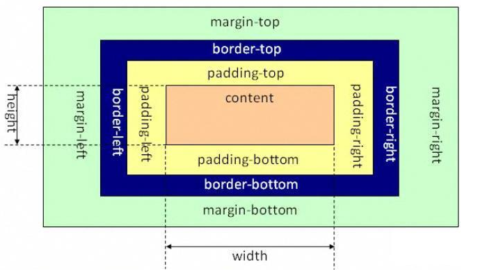
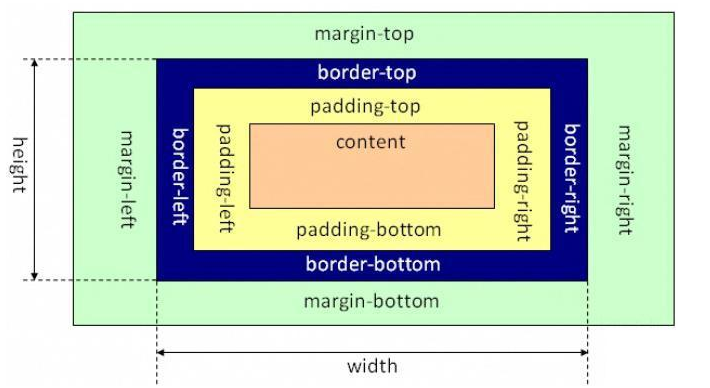

# 盒子模型

### 标准(严格)模式(strict mode)和混杂(怪异)模式(quirks mode)
标准模式是指浏览器按照w3c标准解析执行代码，混杂模式则是浏览器以一种比较宽松的向后兼容的方式显示。混杂模式通常模式老式浏览器（比如Microsoft IE4 和Netscape Navigator 4）的行为以防止老站点无法工作。 
浏览器解析使用标准模式还是怪异模式，与doctype的声明直接相关，DTD声明定义了标准文档的类型，使浏览器使用相应的方式加载网页并显示，忽略DTD声明，将进入怪异模式。 
这两种产生的原因是因为各个浏览器对页面的渲染上存在差异，甚至在同一浏览器不同版本中，对页面的渲染也不相同，在w3c标准出台之前，浏览器对页面的渲染上没有统一规范，产生了差异(quirks mode)，在w3c标准推出后，浏览器渲染页面有了统一的标准（strict mode），这是两者最基本的区别。 
火狐一直是标准模式，所以呈现效果差别不大，但在ie（6,7,8）中，标准模式和混杂模式的差别很大，主要体现在对盒模型的解释上。 

### 标准盒子模型
标准盒子模型的标准是由margin、border、padding、content四部分组成，其中宽度为为content width+boeder*2+padding*2+margin*2,元素宽度为content width+ padding*2+border*2


### 怪异盒子模型
混杂盒子模型也由margin、padding、border、content组成，其中宽为content+border*2+padding*2，外盒宽为content width+margin*2



### 两种模式的触发
浏览器根据doctype是否存在以及声明使用哪种DTD来呈现。 
如果XHTML文档包含形式完整的doctype，则以一般标准模式呈现。 
对于html4.0.1文档，包含严格DTD的doctype以标准模式呈现页面，包含过渡DTD和URI的doctype以标准模式呈现页面，但是有过渡DTD没有URI则以混杂模式呈现。Doctype不存在或者行事不正确则以混杂模式呈现

### 判断处于何种模式下
```
alert(window.top.document.compatMode);
//css1Compat  标准模式
//BackCompat  混杂模式
alert(window.support.boxModel);
//true  标准模式
//false  混杂模式
```

### 解决处于何种模式下的问题
1. 声明DOCTYPE为标准模式，ie6在标准模式下能够符合W3C标准 
2. 使用box-sizing属性，设置为border-box 
 box-sizing是CSS3新增的属性，能够用来修改盒模型，可选值为： 
 a. content-box：默认值，让元素维持W3C的标准盒模型 
 b. border-box：让元素维持IE传统（混杂模式）的盒模型 
 c. inherit：从父元素继承box-sizing属性的值
